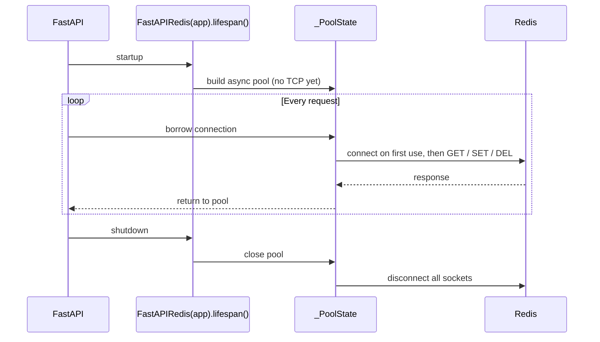
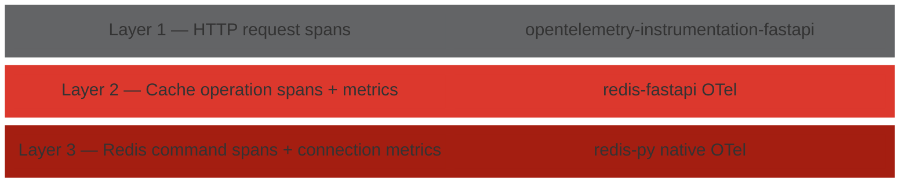

# Architecture

This page covers the key architectural decisions behind redis-fastapi and the
reasoning that shaped them.

---

## Connection lifecycle

All components — DI factories and `CacheBackend` —
share a single async Redis connection pool managed by the
[FastAPI lifespan](https://fastapi.tiangolo.com/advanced/events/#lifespan).

Every request borrows from the same pool rather than opening a new TCP
socket.  This bounds the number of connections to Redis, avoids per-request
TLS handshakes, and keeps connection limits predictable under load.

Pool construction is cheap — `redis-py` pools are lazy and allocate empty
bookkeeping (~48 bytes, ~4 µs) without opening any sockets.

Tying the pool to the lifespan gives deterministic startup and shutdown.
The pool is guaranteed to exist before the first request and is drained
gracefully when the app stops — no leaked sockets, no race conditions.




---

## Lifespan wrapping

`FastAPIRedis(app).lifespan()` wraps the app's existing lifespan rather than
replacing it.  FastAPI only accepts
[one lifespan](https://github.com/fastapi/fastapi/discussions/10083), so
if the library owned it outright, the user would have to manually compose
it with every other library's lifespan.  Wrapping avoids this — multiple
builder calls just nest around whatever is already there, starting up in
registration order and tearing down in reverse.

This relies on `app.router.lifespan_context`, which is not part of
Starlette's public API but has been stable since 0.20+ and is used
internally by FastAPI's own
[router lifespan merging](https://github.com/fastapi/fastapi/pull/9630).
Nesting order is determined by call order rather than being explicitly
visible, which can make debugging startup hangs harder.

For scenarios where explicit ordering matters, skip `.lifespan()` and
compose manually using `redis_lifespan`:

```python
from contextlib import asynccontextmanager
from redis_fastapi import FastAPIRedis, redis_lifespan

@asynccontextmanager
async def my_lifespan(app):
    async with redis_lifespan(app):
        async with db_lifespan(app):
            yield

app = FastAPI(lifespan=my_lifespan)
FastAPIRedis(app).caching()   # no .lifespan() — user owns the lifespan
```

The builder methods are independent — `.caching()` does not require
`.lifespan()` (but it is recommended).


---

## Async-first design and sync endpoint support

redis-fastapi is **async-only at the transport layer** — the sole Redis
connection pool is an `redis.asyncio` pool.  There is no sync `redis.Redis`
pool.  This section explains why that works for both `async def` and plain
`def` endpoints.

For background on how FastAPI handles `async def` vs `def`, see
[Concurrency and async / await](https://fastapi.tiangolo.com/async/)
(especially the [Very Technical Details](https://fastapi.tiangolo.com/async/#very-technical-details)
section).

### How FastAPI dispatches endpoints and dependencies

| Declaration | Where it runs | Blocking I/O safe? |
|---|---|---|
| `async def endpoint(…)` | Main event loop | No — would block all requests |
| `def endpoint(…)` | Worker threadpool (`anyio.to_thread`) | Yes |
| `async def dependency(…)` | Main event loop | No |
| `def dependency(…)` | Worker threadpool | Yes |

All of redis-fastapi's DI factories (`cache()`, `cache_evict()`,
`cache_put()`, `get_cache_backend()`) are `async def`.  They run on the
event loop and use `await` for every Redis call — no thread is blocked.
Sync endpoints that declare these as `Depends(…)` still work correctly:
FastAPI awaits the async dependency on the event loop, then hands the
resolved value to the sync endpoint which runs in the threadpool.

### `CacheBackendDep` — async endpoints

`CacheBackendDep` injects a `CacheBackend` whose methods (`get`, `set`,
`delete`, `has`, `delete_group`) are all coroutines.  Use it from
`async def` endpoints:

```python
@app.get("/items/{item_id}")
async def get_item(item_id: int, cb: CacheBackendDep) -> dict:
    cached = await cb.get(f"item:{item_id}")
    if cached:
        return cached
    item = await fetch_item(item_id)
    await cb.set(f"item:{item_id}", item, ttl=300)
    return item
```

### `SyncCacheBackendDep` — sync endpoints

Sync (`def`) endpoints cannot `await`.  `SyncCacheBackendDep` provides a
blocking wrapper that bridges each call back to the event loop via
[`anyio.from_thread.run`](https://anyio.readthedocs.io/en/stable/threads.html#calling-asynchronous-code-from-a-worker-thread):

```python
@app.get("/items/{item_id}")
def get_item(item_id: int, cb: SyncCacheBackendDep) -> dict:
    cached = cb.get(f"item:{item_id}")      # blocking — runs on event loop
    if cached:
        return cached
    item = fetch_item(item_id)
    cb.set(f"item:{item_id}", item, ttl=300)
    return item
```

Under the hood, each `SyncCacheBackend` method does:

```
worker thread                         event loop
─────────────                         ──────────
cb.set("k", v, ttl=60)
  └─ anyio.from_thread.run(lambda)
       └─ schedules ──────────────► await backend.set("k", v, ttl=60)
          blocks thread ◄──────────  result / exception
```

This only works from threads managed by FastAPI's
[AnyIO](https://anyio.readthedocs.io/) threadpool (sync endpoints and sync
dependencies).  Calling `SyncCacheBackend` from the main thread or an
arbitrary thread raises `RuntimeError`.

### Why no sync Redis pool?

The library's purpose is high-level DI features (caching, rate limiting,
sessions) — not raw Redis access.  All of those features use the async
client internally.  Maintaining a parallel sync pool would mean:

- Doubling pool-management code in the lifespan.
- Keeping two client wrappers (`Redis` + `AsyncRedis`) in sync.
- Opening a second set of TCP connections that most apps never use.

Users who need a raw sync `redis.Redis` client can create one outside the
library in two lines.

### The DI caching factories (`cache()`, `cache_evict()`, `cache_put()`)

These work with **both** `async def` and `def` endpoints without any extra
setup.  They are `async def` generators resolved by FastAPI's DI system
*before* the endpoint runs.  The endpoint function itself never touches
Redis — caching is handled entirely in the dependency and middleware layers.
See [Caching § Sync endpoint support](caching.md) for details.

---

## Why dependency injection, not decorators

Many FastAPI caching libraries — most notably
[fastapi-cache2](https://github.com/long2ice/fastapi-cache) — use a
`@cache` decorator that wraps the endpoint function.  redis-fastapi
**deliberately avoids this pattern** and uses FastAPI's native dependency
injection (`Depends()`) instead.  The decorator approach has five concrete
problems in FastAPI:

1. **Signature rewriting is fragile.**  A caching decorator must inject
   hidden `Request` / `Response` parameters via `__signature__` manipulation.
   FastAPI relies on function introspection for validation, OpenAPI generation,
   and dependency resolution; rewriting the signature operates *outside* that
   system and is a known source of breakage
   ([fastapi#1743](https://github.com/fastapi/fastapi/issues/1743),
   [fastapi#5065](https://github.com/fastapi/fastapi/issues/5065),
   [article](https://saharsh-solanki.medium.com/how-decorators-can-break-fastapi-endpoints-and-how-to-fix-it-398a540b8e0a)).

2. **Conflicts with other DI-based libraries.**  Decorator-based route
   wrapping prevents other `Depends()`-based libraries (pagination, security,
   DB sessions) from initializing correctly
   ([fastapi-cache#557](https://github.com/long2ice/fastapi-cache/issues/557),
   [fastapi-cache#89](https://github.com/long2ice/fastapi-cache/issues/89)).

3. **`dependency_overrides` cannot reach decorator internals.**  FastAPI's
   primary test-mocking mechanism only works with `Depends()` callables.
   Logic inside a decorator bypasses the DI container entirely
   ([fastapi#4330](https://github.com/tiangolo/fastapi/issues/4330)).

4. **Decorator order is silently significant.**  `@app.get` must come before
   `@cache`, which must come before `@cache_evict`.  Reversing the order
   silently breaks caching.  DI dependencies are resolved as a graph — no
   ordering constraints.

5. **Ecosystem mismatch.**  FastAPI consistently models cross-cutting concerns
   as dependencies: authentication (`Depends(get_current_user)`), database
   sessions (`Depends(get_db)`).  The
   [official documentation](https://fastapi.tiangolo.com/tutorial/dependencies/dependencies-in-path-operation-decorators/)
   specifically shows this pattern for side-effect-only concerns — which is
   exactly what caching is.

Our DI-based design (`cache()`, `cache_evict()`, `cache_put()`) resolves all
five issues.  On cache hit, the dependency raises a `CacheHitException`
(caught by a registered exception handler) that returns the cached response
directly — the endpoint never executes.  On cache miss, a lightweight capture
middleware stores the response in Redis after the endpoint returns.  See
[Caching § Caching factories](caching.md#1-caching-factories) for usage.

---

## Why not a full ASGI middleware for cache reads?

An earlier design used an ASGI middleware to intercept requests *before*
routing and return cached responses without entering the FastAPI pipeline at
all.  In theory this is the fastest possible path — no DI resolution, no routing.

In practice, benchmarks showed **no measurable improvement** over the
pure-DI approach.  The ~0.5–2 ms saved by skipping FastAPI's pipeline is
dwarfed by the Redis round-trip and client network latency
(see [Benchmarks](benchmarks.md#what-happens-when-latency-increases)).
The middleware also introduced problems the DI path does not have:

- **Route registry fragility.** The middleware runs before DI, so per-route
  config (TTL, eviction group, key builder) must be pre-computed into a lookup
  table at startup.  This breaks with lazy route registration, dynamic
  routes, and mounted sub-applications.
- **Two mechanisms to coordinate.** Users must register both the middleware
  and the per-route dependency; forgetting the middleware silently disables
  caching.
- **Cross-layer key consistency.** Eviction and write-through dependencies
  must produce the same cache keys as the middleware — an error-prone
  coupling.
- **Harder to test.** `dependency_overrides` covers the DI config but not
  the middleware; tests require ASGI-level fixtures.

The current design keeps a single lightweight middleware
(`CacheResponseCaptureMiddleware`) solely for **miss-path writes** — it
buffers the response body and stores it in Redis after the endpoint returns.
Cache *reads* and short-circuiting happen entirely in the DI layer via
`CacheHitException`.

---

## Storage model — strings vs hashes

Every cached entry is stored as a standalone Redis
[string](https://redis.io/docs/latest/develop/data-types/strings/) key,
with eviction groups encoded as key prefixes.  Eviction-group deletion uses
[`SCAN`](https://redis.io/docs/latest/commands/scan/) + `DEL` to find and
remove matching keys.

Redis [hashes](https://redis.io/docs/latest/develop/data-types/hashes/)
would be a natural fit — one hash per eviction group, one field per entry.
Since Redis 7.4 added
[per-field expiration](https://redis.io/blog/hash-field-expiration-architecture-and-benchmarks/)
and Redis 8.0 added [`HSETEX`](https://redis.io/docs/latest/commands/hsetex/),
the main historical blocker is gone.  Group deletion becomes a single
`DEL` (~59× faster than `SCAN` + `DEL` at 1000 entries), and memory drops
~5% from eliminating per-key overhead.  Reads and writes are effectively
identical in latency.

Strings remain the default for three reasons:
[`HSETEX`](https://redis.io/docs/latest/commands/hsetex/) requires
Redis ≥ 8.0 and many deployments still run 7.x; key-level features
(keyspace notifications, `MEMORY USAGE` per entry) don't work on hash
fields;

## Telemetry

redis-fastapi supports [OpenTelemetry](https://opentelemetry.io/) for
observability.  Instrumentation is split into three independent layers:



Each layer can be enabled independently.  When all three are active, a single
request produces a nested trace:

```
HTTP GET /products/42           ← Layer 1
 └── cache.get (HIT)            ← Layer 2
      └── redis GET             ← Layer 3
```

### Layer 1 — HTTP requests

Handled by the standard
[FastAPI OTel instrumentation](https://opentelemetry-python-contrib.readthedocs.io/en/latest/instrumentation/fastapi/fastapi.html).
Install `opentelemetry-instrumentation-fastapi` and call
`FastAPIInstrumentor.instrument_app(app)`.

### Layer 2 — Cache operations

This is what redis-fastapi adds.  Enable with the builder or an environment
variable:

```python
FastAPIRedis(app).lifespan().caching().otel()   # builder
```

```bash
export REDIS_OTEL_ENABLED=true           # env var
```

Requires `pip install redis-fastapi[otel]`.

**Spans** — one per cache operation, named following the
[OTel span naming guidelines](https://opentelemetry.io/docs/specs/semconv/general/how-to-define-semantic-conventions/#naming-pattern)
(`{action} {target}` pattern, low cardinality, human-readable).
Note: there is no official OTel semantic convention for caching yet — span
and metric naming for cache operations is
[under discussion](https://github.com/open-telemetry/semantic-conventions/issues/1747).
Our names may change to align once a convention is adopted.

| Span | Source |
|------|--------|
| `cache.get` | `cache()` dependency (attributes: `cache.hit`, `cache.key`, `cache.eviction_group`, `cache.ttl`) |
| `cache.set` | Capture middleware after a cache miss |
| `cache.evict` | `cache_evict()` dependency |
| `cache.put` | `cache_put()` dependency |
| `cache.backend.*` | `CacheBackend` methods (`get`, `set`, `delete`, `delete_group`, `has`) |

**Metrics:**

| Metric | Type | Labels | Description |
|--------|------|--------|-------------|
| `redis_fastapi.cache.requests` | Counter | `result` (`hit` / `miss` / `bypass`), `eviction_group` | Total cache lookups |
| `redis_fastapi.cache.writes` | Counter | `type` (`miss_fill` / `write_through`), `eviction_group` | Cache writes |
| `redis_fastapi.cache.evictions` | Counter | `type` (`key` / `group`), `eviction_group` | Cache invalidations |
| `redis_fastapi.cache.latency` | Histogram | `operation` (`get` / `set` / `evict`), `eviction_group` | Operation duration in seconds |

### Layer 3 — Redis commands

Instruments every `GET`, `SET`, `DEL`, etc. at the driver level.  Enable via:

```bash
export REDIS_OTEL_REDIS_ENABLED=true
```

Or use `opentelemetry-instrumentation-redis` externally — but not both at
once, to avoid duplicate spans.

For full configuration details (all env vars, non-intrusiveness guarantee),
see the [Configuration guide — OpenTelemetry](configuration.md#opentelemetry).