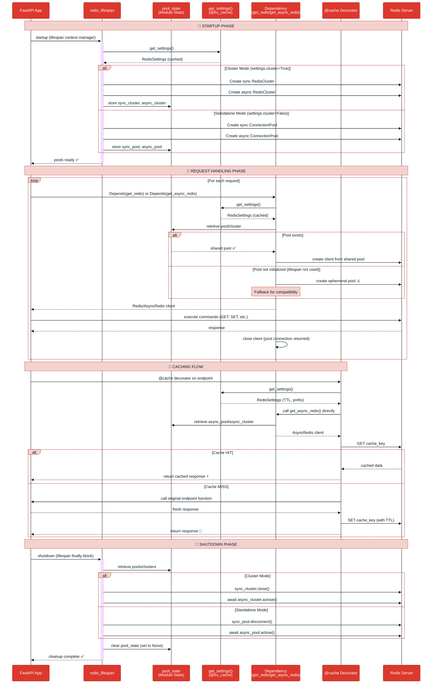
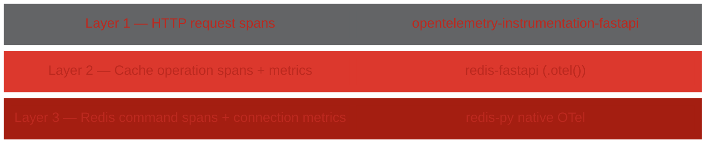

# Architecture: Lifecycle Design

## Design Summary

The library follows FastAPI's lifespan pattern with a **shared connection pool architecture** where `redis_lifespan` creates both sync and async Redis connection pools (or cluster clients) at application startup and stores them in module-level state (`pool_state`), while dependency injection functions (`get_redis` and `get_async_redis`) retrieve clients from these shared pools for each request, falling back to creating ephemeral pools if the lifespan wasn't used. This design optimizes performance by reusing connections across requests while maintaining FastAPI's dependency injection paradigm, supports both standalone and OSS Cluster modes through runtime configuration (`get_settings().cluster`), and ensures proper cleanup by disconnecting all pools during application shutdown. The `@cache` decorator leverages `get_async_redis()` directly (not via dependency injection) to access the shared pool, while Pydantic Settings (`get_settings()`) uses `@lru_cache` to provide a singleton configuration instance that's loaded once from environment variables and `.env` files.

## Lifecycle Diagram



## Key Design Decisions

### 1. Shared Pool Architecture
- **Why**: Reuse connections across requests for better performance
- **How**: Module-level `pool_state` stores pools/clusters
- **Tradeoff**: Global state vs. performance (performance wins)

### 2. Lifespan Pattern
- **Why**: FastAPI's recommended way to manage startup/shutdown
- **How**: `@asynccontextmanager` creates pools on startup, destroys on shutdown
- **Reference**: [FastAPI Lifespan Events](https://fastapi.tiangolo.com/advanced/events/#lifespan)

### 3. Dependency Injection
- **Why**: FastAPI-native pattern, easy testing via `app.dependency_overrides`
- **How**: `Depends(get_redis)` and `Depends(get_async_redis)`
- **Reference**: [FastAPI Dependencies](https://fastapi.tiangolo.com/tutorial/dependencies/)

### 4. Fallback to Ephemeral Pools
- **Why**: Works without lifespan (backwards compatibility, convenience)
- **How**: `get_redis()` checks `pool_state`, creates new pool if None
- **Tradeoff**: Convenience vs. performance warning in docs

### 5. Pydantic Settings with @lru_cache
- **Why**: Singleton configuration, reads env vars once
- **How**: `@lru_cache` on `get_settings()` returns same instance
- **Reference**: [FastAPI Settings](https://fastapi.tiangolo.com/advanced/settings/)

### 6. Cache Decorator Uses Direct get_async_redis()
- **Why**: Decorators execute at import time, can't use `Depends()`
- **How**: Calls `get_async_redis()` directly in async wrapper
- **Tradeoff**: Not true dependency injection, but works with shared pool

## Telemetry

redis-fastapi supports [OpenTelemetry](https://opentelemetry.io/) for
observability.  Instrumentation is split into three independent layers:



Each layer can be enabled independently.  When all three are active, a single
request produces a nested trace:

```
HTTP GET /products/42           ← Layer 1
 └── cache.get (HIT)            ← Layer 2
      └── redis GET             ← Layer 3
```

### Layer 1 — HTTP requests

Handled by the standard
[FastAPI OTel instrumentation](https://opentelemetry-python-contrib.readthedocs.io/en/latest/instrumentation/fastapi/fastapi.html).
Install `opentelemetry-instrumentation-fastapi` and call
`FastAPIInstrumentor.instrument_app(app)`.

### Layer 2 — Cache operations

This is what redis-fastapi adds.  Enable with the builder or an environment
variable:

```python
FastAPIRedis(app).lifespan().caching().otel()   # builder
```

```bash
export REDIS_OTEL_ENABLED=true           # env var
```

Requires `pip install redis-fastapi[otel]`.

**Spans** — one per cache operation:

| Span | Source |
|------|--------|
| `cache.get` | `cache()` dependency (attributes: `cache.hit`, `cache.key`, `cache.namespace`, `cache.ttl`) |
| `cache.set` | Capture middleware after a cache miss |
| `cache.evict` | `cache_evict()` dependency |
| `cache.put` | `cache_put()` dependency |
| `cache.backend.*` | `CacheBackend` methods (`get`, `set`, `delete`, `delete_namespace`, `has`) |

**Metrics:**

| Metric | Type | Labels | Description |
|--------|------|--------|-------------|
| `redis_fastapi.cache.requests` | Counter | `result` (`hit` / `miss` / `bypass`), `namespace` | Total cache lookups |
| `redis_fastapi.cache.writes` | Counter | `type` (`miss_fill` / `write_through`), `namespace` | Cache writes |
| `redis_fastapi.cache.evictions` | Counter | `type` (`key` / `namespace`), `namespace` | Cache invalidations |
| `redis_fastapi.cache.latency` | Histogram | `operation` (`get` / `set` / `evict`), `namespace` | Operation duration in seconds |

### Layer 3 — Redis commands

Instruments every `GET`, `SET`, `DEL`, etc. at the driver level.  Enable via:

```bash
export REDIS_OTEL_REDIS_ENABLED=true
```

Or use `opentelemetry-instrumentation-redis` externally — but not both at
once, to avoid duplicate spans.

For full configuration details (all env vars, non-intrusiveness guarantee),
see the [Configuration guide — OpenTelemetry](../guide/configuration.md#opentelemetry).

## Further Reading

- **Lifespan Management**: [`src/redis_fastapi/lifespan.py`](../../src/redis_fastapi/lifespan.py)
- **Dependency Providers**: [`src/redis_fastapi/deps.py`](../../src/redis_fastapi/deps.py)
- **Configuration**: [`docs/guide/configuration.md`](../guide/configuration.md)
- **Caching Internals**: [`src/redis_fastapi/cache.py`](../../src/redis_fastapi/cache.py)
- **FastAPI Lifespan**: https://fastapi.tiangolo.com/advanced/events/#lifespan
- **FastAPI Dependencies**: https://fastapi.tiangolo.com/tutorial/dependencies/
- **FastAPI Settings**: https://fastapi.tiangolo.com/advanced/settings/
