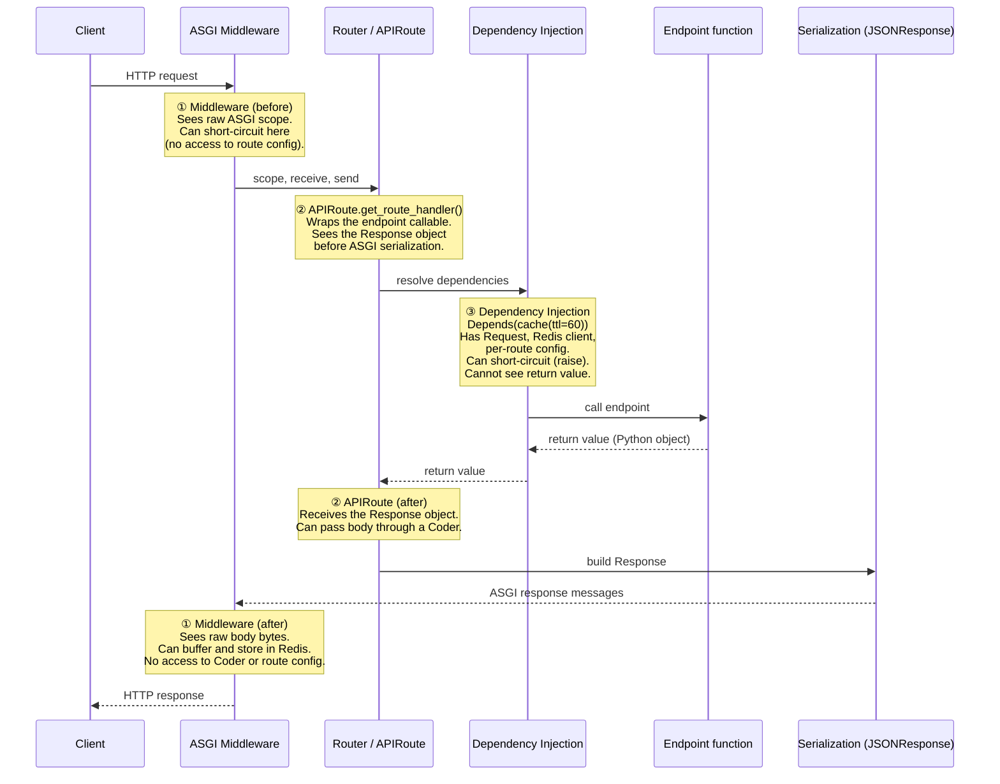

# Cache interception points in FastAPI

This page explains where caching logic can hook into a FastAPI request and
why redis-fastapi uses the combination it does.

---

## Request lifecycle

## How redis-fastapi uses these hooks

| Concern | Hook | Why |
|---|---|---|
| Cache **read** + short-circuit on hit | **③ DI** — `Depends(cache(ttl=60))` | Full access to `Request`, Redis client, per-route config. `dependency_overrides` works for testing. Short-circuits by raising `CacheHitException`. |
| Cache **write** on miss | **① Middleware** — `CacheResponseCaptureMiddleware` | Runs after the response is fully serialized. Registered once by `add_redis_caching(app)`, transparent to the user. |

---

## Why not use APIRoute for the write path?

A custom `APIRoute` subclass (hook ②) would give the write path access to
the `Response` object and the `Coder`, solving the binary-body problem that
the middleware currently has. However, `route_class` is consumed at **route
registration time** — it determines which `Route` subclass wraps each
endpoint when `@app.get(...)` is evaluated.

This creates an unsolvable ordering problem for auto-configuration:

- **`app.router.route_class = CachedRoute`** only affects routes registered
  *after* the call. The natural FastAPI pattern is to define routes first
  and call builder methods (like `FastAPIRedis(app).caching()`) second, so
  existing routes would not be wrapped.
- **Retroactively walking `app.routes`** to patch already-registered routes
  requires reaching into Starlette's internal `Route.app` / `Route.endpoint`
  attributes — undocumented and fragile.
- **Requiring the builder call before route registration** breaks the
  standard FastAPI setup order and surprises users.

ASGI middleware does not have this problem. It wraps the entire application
at the outermost layer regardless of when routes are registered or how
sub-applications are mounted. This is why the miss-path write uses
middleware despite its limitations (no access to the `Coder`, body stored
as a JSON string rather than passed through the user's serializer).
