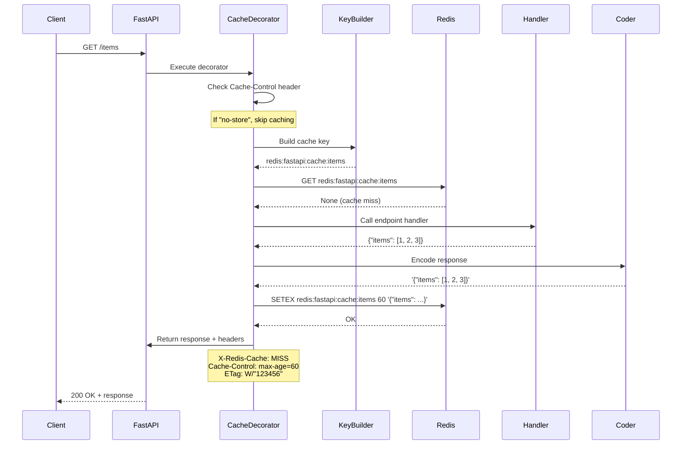
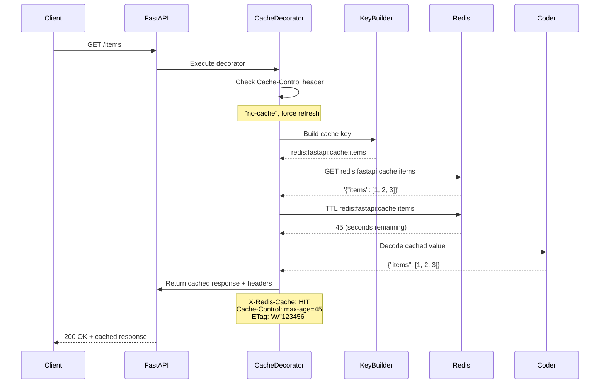
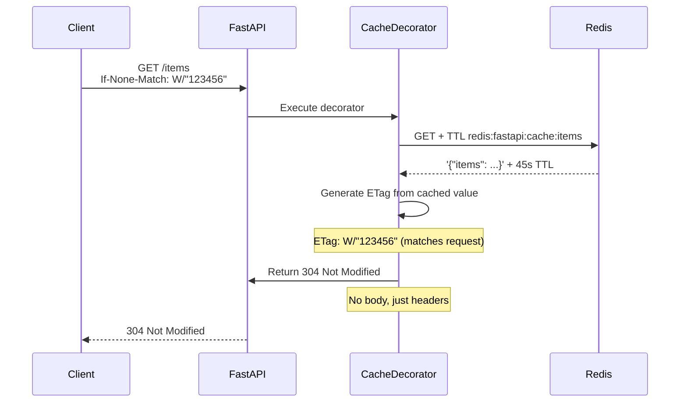

# Caching Internals: How It Works

This document provides a deep technical explanation of how the caching functionality works in redis-fastapi, including sequence diagrams, collision handling, invalidation strategies, and configuration.

---

## Table of Contents

- [Architecture Overview](#architecture-overview)
- [Cache Flow Sequence](#cache-flow-sequence)
- [Cache Key Generation](#cache-key-generation)
- [Cache Collisions](#cache-collisions)
- [Cache Invalidation](#cache-invalidation)
- [HTTP Cache Semantics](#http-cache-semantics)
- [Configuration](#configuration)
- [Performance Characteristics](#performance-characteristics)

---

## Architecture Overview

The caching system consists of several components working together:

```
┌─────────────────────────────────────────────────────────────┐
│                         @cache Decorator                     │
│  ┌──────────┐  ┌──────────┐  ┌──────────┐  ┌──────────┐   │
│  │   Key    │  │  Coder   │  │  Redis   │  │   HTTP   │   │
│  │ Builder  │  │ (JSON)   │  │  Client  │  │ Headers  │   │
│  └──────────┘  └──────────┘  └──────────┘  └──────────┘   │
└─────────────────────────────────────────────────────────────┘
         │              │              │              │
         │              │              │              │
    ┌────▼──────────────▼──────────────▼──────────────▼─────┐
    │              FastAPI Endpoint Handler                  │
    └────────────────────────────────────────────────────────┘
                             │
                             ▼
                    ┌─────────────────┐
                    │  Redis Server   │
                    │  (Connection    │
                    │   Pool)         │
                    └─────────────────┘
```

### Key Components

1. **Cache Decorator** (`@cache`): Wraps endpoint functions to intercept requests/responses
2. **Key Builder**: Generates unique cache keys from request data
3. **Coder**: Serializes/deserializes response data (default: JSON)
4. **Redis Client**: Async Redis connection (via `AsyncRedisDep`)
5. **HTTP Headers**: Manages cache control, ETags, and 304 responses

---

## Cache Flow Sequence

### Cache MISS Flow



### Cache HIT Flow



### 304 Not Modified Flow (ETag Match)



---

## Cache Key Generation

### Default Key Builder Logic

The `default_key_builder` creates deterministic cache keys:

```python
def default_key_builder(request: Request, namespace: str = "", prefix: str = "") -> str:
    """
    Structure: {prefix}[:{namespace}]:{path}[:{query_params}]
    
    Examples:
      GET /api/v1/items
      → redis:fastapi:cache:api:v1:items
      
      GET /items?page=2&sort=name
      → redis:fastapi:cache:items:page=2:sort=name
      
      GET /items?sort=name&page=2  (same as above - sorted!)
      → redis:fastapi:cache:items:page=2:sort=name
    """
    path = request.url.path.strip("/").replace("/", ":")
    parts = []
    
    if prefix:
        parts.append(prefix)
    if namespace:
        parts.append(namespace)
    if path:
        parts.append(path)
    
    # Query params are SORTED for deterministic keys
    if request.query_params:
        qs = ":".join(f"{k}={v}" for k, v in sorted(request.query_params.items()))
        parts.append(qs)
    
    return ":".join(parts)
```

### Key Building Strategy

| Component | Purpose | Example |
|-----------|---------|---------|
| **Prefix** | Namespace isolation | `redis:fastapi:cache` |
| **Namespace** | API version / variant | `v2` |
| **Path** | Endpoint identifier | `api:users:123` |
| **Query Params** | Request parameters | `page=2:sort=name` |

### Why Sort Query Params?

**Problem**: Different parameter orders should cache the same:
- `/items?page=2&sort=name`
- `/items?sort=name&page=2`

**Solution**: Sort parameters alphabetically to ensure consistent keys.

### Redis Key Length Limits

**Redis theoretical maximum**: 512 MB per key
**Practical limit**: ~1 KB (performance degrades beyond this)
**Redis recommendation**: Keep keys < 100 bytes for optimal performance

#### Potential Issues

Very long URLs with many query parameters can create excessively long cache keys:

```python
# Problematic: Very long query string
GET /search?q=long+query&filter1=x&filter2=y&...&filter50=z
→ redis:fastapi:cache:search:filter1=x:filter2=y:...:filter50=z

# Key length could exceed 1KB, causing performance issues
```

#### Solutions

**1. Hash Long Keys (Recommended)**

For URLs with many query params or very long paths, hash the key:

```python
import hashlib

def hashed_key_builder(
    request: Request,
    namespace: str = "",
    prefix: str = "",
    max_length: int = 200,
) -> str:
    """Build cache key, hashing if it exceeds max_length."""
    # Build key normally
    base_key = default_key_builder(request, namespace, prefix)

    # If key is too long, hash it
    if len(base_key) > max_length:
        # Keep prefix for debuggability
        prefix_part = f"{prefix}:{namespace}" if namespace else prefix

        # Hash the full URL
        url_hash = hashlib.sha256(str(request.url).encode()).hexdigest()[:16]

        # Return: prefix:hash
        return f"{prefix_part}:hash:{url_hash}"

    return base_key

@app.get("/search")
@cache(ttl=60, key_builder=hashed_key_builder)
async def search(q: str, filter1: str = None, ...):
    ...
```

**Benefits**:
- ✅ Consistent short keys
- ✅ No Redis performance degradation
- ✅ Works with any URL length

**Trade-offs**:
- ❌ Less debuggable (can't read URL from key)
- ❌ Hash collisions (extremely rare with SHA256)

**2. Truncate Query Parameters**

Only include critical query params in cache key:

```python
def selective_key_builder(
    request: Request,
    namespace: str = "",
    prefix: str = "",
) -> str:
    """Build key using only selected query params."""
    path = request.url.path.strip("/").replace("/", ":")
    parts = [prefix, namespace, path] if namespace else [prefix, path]
    parts = [p for p in parts if p]  # Remove empty

    # Only cache on specific params (ignore others)
    cache_params = ["page", "limit", "sort"]
    qs_parts = []
    for k in sorted(cache_params):
        if k in request.query_params:
            qs_parts.append(f"{k}={request.query_params[k]}")

    if qs_parts:
        parts.append(":".join(qs_parts))

    return ":".join(parts)

@app.get("/search")
@cache(ttl=60, key_builder=selective_key_builder)
async def search(page: int = 1, limit: int = 10, sort: str = "name", q: str = ""):
    # 'q' is NOT in cache key, so different queries share cache (probably wrong!)
    # Only page/limit/sort differentiate cached responses
    ...
```

**Benefits**:
- ✅ Short, readable keys
- ✅ Predictable key length

**Trade-offs**:
- ⚠️ Must carefully choose which params matter
- ⚠️ Different queries might share cache incorrectly

**3. Hybrid: Hash Only Long Query Strings**

Keep path readable, hash only the query string if long:

```python
def hybrid_key_builder(
    request: Request,
    namespace: str = "",
    prefix: str = "",
    query_max_length: int = 150,
) -> str:
    """Hash query string if it's too long."""
    path = request.url.path.strip("/").replace("/", ":")
    parts = []
    if prefix:
        parts.append(prefix)
    if namespace:
        parts.append(namespace)
    if path:
        parts.append(path)

    # Build query string
    if request.query_params:
        qs = ":".join(f"{k}={v}" for k, v in sorted(request.query_params.items()))

        # Hash if too long
        if len(qs) > query_max_length:
            qs_hash = hashlib.sha256(qs.encode()).hexdigest()[:12]
            parts.append(f"qs:{qs_hash}")
        else:
            parts.append(qs)

    return ":".join(parts)
```

**Benefits**:
- ✅ Path remains readable in Redis
- ✅ Handles long query strings safely
- ✅ Short query strings stay readable

**Recommended for production**.

#### Key Length Monitoring

Add validation to catch excessively long keys:

```python
def validated_key_builder(
    request: Request,
    namespace: str = "",
    prefix: str = "",
    max_length: int = 250,
) -> str:
    """Build key with length validation."""
    key = default_key_builder(request, namespace, prefix)

    if len(key) > max_length:
        import logging
        logger = logging.getLogger(__name__)
        logger.warning(
            f"Cache key too long ({len(key)} bytes): {key[:100]}... "
            f"Consider using hashed_key_builder"
        )

        # Fall back to hashed version
        url_hash = hashlib.sha256(str(request.url).encode()).hexdigest()[:16]
        return f"{prefix}:hash:{url_hash}"

    return key
```

#### Best Practices

1. ✅ **Monitor key lengths** in development
2. ✅ **Use hashed keys** for search/filter endpoints with many params
3. ✅ **Keep keys under 200 bytes** when possible
4. ✅ **Log warnings** when keys exceed thresholds
5. ❌ **Don't cache** endpoints with unbounded query params without hashing
6. ❌ **Don't truncate** query params unless you understand the implications

---

## Cache Collisions

### What Are Cache Collisions?

A collision occurs when two different requests map to the same cache key.

### Collision Scenarios

#### 1. **Path Parameter Ambiguity** (NOT a collision in redis-fastapi)

```python
# These have DIFFERENT cache keys (no collision)
GET /users/123/posts    → redis:fastapi:cache:users:123:posts
GET /users/456/posts    → redis:fastapi:cache:users:456:posts
```

✅ **No collision**: Path parameters are part of the URL path, creating unique keys.

#### 2. **Query Parameter Order** (Handled by sorting)

```python
GET /items?a=1&b=2    → redis:fastapi:cache:items:a=1:b=2
GET /items?b=2&a=1    → redis:fastapi:cache:items:a=1:b=2  # SAME KEY
```

✅ **No collision**: Query params are sorted before key generation.

#### 3. **Method Collision** (Prevented by only caching GET)

```python
GET  /items    → Cached
POST /items    → NOT cached (different method)
```

✅ **No collision**: Only `GET` requests are cached.

#### 4. **Header/Body Differences** (POTENTIAL COLLISION)

```python
# Same URL, different Accept headers
GET /items  (Accept: application/json)     → Same cache key
GET /items  (Accept: application/xml)      → Same cache key ⚠️
```

⚠️ **Potential collision**: Headers are NOT part of cache key by default.

### Handling Header-Based Responses

**Solution**: Use a custom key builder that includes relevant headers:

```python
def header_aware_key_builder(
    request: Request,
    namespace: str = "",
    prefix: str = "",
) -> str:
    base_key = default_key_builder(request, namespace, prefix)
    
    # Include Accept header in key
    accept = request.headers.get("Accept", "")
    if accept:
        base_key += f":accept={accept}"
    
    return base_key

@app.get("/items")
@cache(ttl=60, key_builder=header_aware_key_builder)
async def get_items():
    ...
```

### Collision Prevention Best Practices

1. ✅ **Use path parameters** for resource IDs (not query params when possible)
2. ✅ **Include discriminating data in URL** (version, format)
3. ✅ **Use namespaces** for API versions (`@cache(namespace="v2")`)
4. ✅ **Custom key builders** for header-dependent responses
5. ❌ **Don't cache** user-specific data without including user ID in key

---

## Cache Invalidation

### Current Invalidation Methods (v0.1.0)

#### 1. **Automatic Expiry (TTL)**

```python
@cache(ttl=60)  # Auto-expires after 60 seconds
```

**Pros**: Simple, no manual management  
**Cons**: Stale data for up to TTL duration

#### 2. **Manual Redis Operations**

```python
from redis_fastapi import AsyncRedisDep

@app.delete("/items/{id}")
async def delete_item(id: int, redis: AsyncRedisDep):
    # Delete from database
    await db.delete_item(id)
    
    # Manual cache invalidation
    cache_key = f"redis:fastapi:cache:items:{id}"
    await redis.delete(cache_key)
    
    return {"deleted": id}
```

**Pros**: Precise control  
**Cons**: Manual, error-prone, requires knowing key structure

#### 3. **Force Refresh with Headers**

```bash
# Client forces cache refresh
curl -H "Cache-Control: no-cache" http://api/items
```

**Pros**: Client-controlled  
**Cons**: Requires client cooperation

### Future Invalidation Methods (v0.2.0+)

#### Pattern-Based Clearing (v0.2.0)

```python
from redis_fastapi import clear_cache_pattern

@app.post("/users/{user_id}")
async def update_user(user_id: int):
    # Update user...
    
    # Clear all user-related caches
    await clear_cache_pattern(f"/users/{user_id}/*")
```

#### Cache Tags (v0.3.0)

```python
@cache(ttl=300, tags=["user:{user_id}"])
async def get_user_data(user_id: int):
    ...

# Invalidate by tag
await invalidate_tags(f"user:{user_id}")
```

#### Distributed Invalidation (v0.3.0)

```python
# Invalidate across all app instances
await invalidate_cache_distributed("/users/{user_id}")
```

---

## HTTP Cache Semantics

### Cache Control Headers

#### Response Headers (Cache HIT)

```http
HTTP/1.1 200 OK
X-Redis-Cache: HIT
Cache-Control: max-age=45
ETag: W/"987654321"
Content-Type: application/json

{"items": [1, 2, 3]}
```

| Header | Value | Meaning |
|--------|-------|---------|
| `X-Redis-Cache` | `HIT` | Response served from cache |
| `Cache-Control` | `max-age=45` | Cache valid for 45 more seconds |
| `ETag` | `W/"987654321"` | Weak ETag (hash of cached value) |

#### Response Headers (Cache MISS)

```http
HTTP/1.1 200 OK
X-Redis-Cache: MISS
Cache-Control: max-age=60
ETag: W/"123456789"
Content-Type: application/json

{"items": [1, 2, 3]}
```

### Request Headers (Client Control)

#### Force Refresh

```http
GET /items HTTP/1.1
Cache-Control: no-cache
```

Forces the cache to refresh (executes handler even if cached).

#### Bypass Caching Entirely

```http
GET /items HTTP/1.1
Cache-Control: no-store
```

Skips caching logic entirely (doesn't check or store).

#### Conditional Request (ETag)

```http
GET /items HTTP/1.1
If-None-Match: W/"987654321"
```

If ETag matches cached value, returns `304 Not Modified` with no body.

### ETag Generation

ETags are weak ETags generated from the hash of the cached value:

```python
cached_value = '{"items": [1, 2, 3]}'
etag = f'W/"{hash(cached_value)}"'  # W/"987654321"
```

**Weak ETag** (`W/` prefix): Indicates semantic equivalence, not byte-for-byte identity.

---

## Configuration

### Decorator-Level Configuration

```python
@cache(
    ttl=120,                     # TTL in seconds (default: settings.default_ttl)
    namespace="v2",              # Extra key segment
    prefix="custom:cache",       # Override default prefix
    coder=MyCustomCoder,         # Custom encoder/decoder
    key_builder=my_key_builder,  # Custom key generation function
)
async def my_endpoint():
    ...
```

### Global Configuration (Environment Variables)

```bash
# Connection
export REDIS_URL=redis://localhost:6379/0
export REDIS_CLUSTER=false

# Caching defaults
export REDIS_PREFIX=redis:fastapi
export REDIS_DEFAULT_TTL=60

# Pool settings
export REDIS_MAX_CONNECTIONS=50
export REDIS_SOCKET_TIMEOUT=5.0
```

### Programmatic Configuration

```python
from redis_fastapi import settings

# Modify global settings
settings.default_ttl = 120
settings.prefix = "myapp"
```

---

## Making Key Generation Globally Configurable

**Q: How hard would it be to make the default key builder configurable?**

**A: Very easy!** Here are the options:

### Option 1: Per-Endpoint (Already Works)

```python
# Define your key builder once
def my_key_builder(request, namespace="", prefix=""):
    # Your custom logic
    return f"{prefix}:custom:{hash(str(request.url))}"

# Use everywhere
@cache(ttl=60, key_builder=my_key_builder)
async def endpoint1(): ...

@cache(ttl=60, key_builder=my_key_builder)
async def endpoint2(): ...
```

### Option 2: Global Default via Module-Level Variable (Current Workaround)

Create a wrapper in your codebase:

```python
# myapp/cache.py
from functools import partial
from redis_fastapi import cache as _cache, default_key_builder
import hashlib

def hashed_key_builder(request, namespace="", prefix="", max_length=200):
    key = default_key_builder(request, namespace, prefix)
    if len(key) > max_length:
        url_hash = hashlib.sha256(str(request.url).encode()).hexdigest()[:16]
        return f"{prefix}:hash:{url_hash}"
    return key

# Create pre-configured cache decorator
cache = partial(_cache, key_builder=hashed_key_builder)

# Now use in your app
from myapp.cache import cache

@cache(ttl=60)  # Uses hashed_key_builder by default!
async def my_endpoint():
    ...
```

### Option 3: Add to RedisSettings (Future Enhancement)

**Proposed change** (would require ~30 lines of code):

```python
# In config.py
from typing import Callable

@dataclass
class RedisSettings:
    # ... existing fields ...

    # Default key builder
    default_key_builder: Callable | None = None

# In cache.py
def cache(..., key_builder: KeyBuilder | None = None):
    # Use settings.default_key_builder if no key_builder provided
    _key_builder = (
        key_builder
        or settings.default_key_builder
        or default_key_builder
    )
    ...
```

**Usage**:
```python
from redis_fastapi import settings

# Set global default
settings.default_key_builder = hashed_key_builder

# All @cache decorators now use it by default
@cache(ttl=60)  # Uses hashed_key_builder
async def endpoint1(): ...

@cache(ttl=60, key_builder=custom_builder)  # Override for specific endpoint
async def endpoint2(): ...
```

### Recommendation

**Current (v0.1.0)**: Use **Option 2** (wrapper with `functools.partial`)
- ✅ Works today
- ✅ No code changes needed
- ✅ Type-safe
- ✅ Per-project customization

**Future (v0.2.0)**: Add **Option 3** to `RedisSettings`
- Would take ~30 minutes to implement
- Clean API
- Consistent with other settings

### Implementation Complexity

**Option 3 (Adding to RedisSettings)**:

**Effort**: Very Low (30 minutes)

**Changes needed**:

1. **config.py** - Add field:
   ```python
   default_key_builder: KeyBuilder | None = None
   ```

2. **cache.py** - Update fallback logic:
   ```python
   _key_builder = (
       key_builder
       or settings.default_key_builder
       or default_key_builder
   )
   ```

3. **Tests** - Add test for global default:
   ```python
   def test_global_key_builder():
       settings.default_key_builder = my_builder
       # Test that @cache uses it
   ```

4. **Docs** - Update configuration page

**Total**: ~4 files, ~30 lines of code

Would you like me to implement Option 3?

### Custom Coder Example

```python
from redis_fastapi import Coder
import orjson

class OrJsonCoder:
    @classmethod
    def encode(cls, value) -> str:
        return orjson.dumps(value).decode()
    
    @classmethod
    def decode(cls, value: str):
        return orjson.loads(value)

@cache(ttl=60, coder=OrJsonCoder)
async def fast_json_endpoint():
    ...
```

### Custom Key Builder Example

```python
def user_aware_key_builder(request: Request, namespace="", prefix="") -> str:
    base_key = default_key_builder(request, namespace, prefix)

    # Include user ID from auth token
    user_id = request.state.user_id  # From middleware
    return f"{base_key}:user={user_id}"

@cache(ttl=60, key_builder=user_aware_key_builder)
async def user_specific_data():
    ...
```

### Lambda Key Builders

**Already supported!** You can use lambdas for simple key builders:

```python
# Simple lambda - hash all URLs
@cache(
    ttl=60,
    key_builder=lambda req, ns="", pfx="": f"{pfx}:{hashlib.sha256(str(req.url).encode()).hexdigest()[:16]}"
)
async def my_endpoint():
    ...

# Lambda with imports (define outside decorator)
hash_builder = lambda req, ns="", pfx="": (
    f"{pfx}:hash:{hashlib.sha256(str(req.url).encode()).hexdigest()[:16]}"
)

@cache(ttl=60, key_builder=hash_builder)
async def search(...):
    ...
```

**Note**: Complex logic should use regular functions for better readability and debugging.

---

## Performance Characteristics

### Current Performance

| Operation | Latency | Description |
|-----------|---------|-------------|
| Cache HIT | ~2ms | Redis GET + TTL + decode (2 network calls) |
| Cache MISS | Handler time + ~1ms | Execute handler + Redis SETEX + encode |
| 304 Response | ~1ms | Redis GET + ETag check (no body) |

### Performance Optimization Opportunities

Based on redis-py best practices, several optimizations are available:

#### 1. **Pipelining for Cache HIT** 🚀 (50% improvement)

**Current issue**: Cache HIT makes 2 separate Redis calls:

```python
# Current implementation - 2 network round trips
raw = await redis.get(cache_key)    # ~1ms
t = await redis.ttl(cache_key)      # ~1ms
# Total: ~2ms
```

**Optimized with pipelining** (1 network round trip):

```python
# Optimized - single round trip
async with redis.pipeline(transaction=False) as pipe:
    pipe.get(cache_key)
    pipe.ttl(cache_key)
    raw, t = await pipe.execute()
# Total: ~1ms (50% reduction)
```

**Impact**:
- ✅ Cache HIT latency: **2ms → 1ms**
- ✅ Throughput: **500 req/s → 1,000 req/s**
- ✅ Lower network traffic and Redis load

**Complexity**: Low (5 lines of code)

**Status**: Planned for v0.2.0

---

#### 2. **Client-Side Caching** 🔥 (100x improvement)

**What is it?**: Redis 6.0+ feature where client caches values locally

**How it works**:
- Client stores frequently accessed values in local memory
- Redis notifies client when keys change (RESP3 tracking)
- Zero network calls for cached reads

**Configuration**:
```python
redis = Redis(
    protocol=3,  # RESP3 required
    cache_config={
        "max_size": 1000,   # Max cached items
        "ttl": 60,          # Local cache TTL
        "policy": "lru",    # Eviction policy
    }
)
```

**Impact**:
- ✅ Cache HIT latency: **2ms → 0.02ms** (100x faster)
- ✅ Throughput: **500 req/s → 50,000 req/s**
- ✅ Offloads Redis server
- ⚠️ Adds ~1-10MB RAM per instance

**Requirements**: Redis 6.0+, redis-py 5.1.0+

**Status**: Planned as opt-in feature for v0.3.0

---

#### 3. **Connection Pool Tuning** 🟡

**Current**: `max_connections = None` (unbounded)

**Problem**: Can exhaust Redis server connections (default max: 10,000)

**Best practice**:
```python
# Calculate optimal pool size
max_connections = concurrent_requests × redis_ops_per_request × 1.5

# Example: 100 concurrent requests, 2 Redis ops each
# max_connections = 100 × 2 × 1.5 = 300
```

**Recommended defaults**:
```python
max_connections = 50           # Reasonable default
health_check_interval = 30     # Seconds between health checks
socket_keepalive = True        # Prevent idle connection drops
```

**Use BlockingConnectionPool**:
```python
from redis.asyncio import BlockingConnectionPool

pool = BlockingConnectionPool(
    max_connections=50,
    timeout=5,  # Wait up to 5s for available connection
)
```

**Benefits**:
- ✅ Prevents "No connections available" errors
- ✅ Automatic backpressure under load
- ✅ More predictable behavior

**Status**: Planned for v0.2.0

---

#### 4. **Additional Optimizations**

**Retry Logic** (resilience):
```python
from redis.retry import Retry
from redis.backoff import ExponentialBackoff

retry = Retry(ExponentialBackoff(cap=10, base=1), retries=3)
```

**Compression** (for large responses):
```python
import zlib

class CompressedCoder:
    @classmethod
    def encode(cls, value) -> str:
        json_str = json.dumps(value)
        compressed = zlib.compress(json_str.encode(), level=6)
        return base64.b64encode(compressed).decode()

    @classmethod
    def decode(cls, value: str):
        compressed = base64.b64decode(value.encode())
        json_str = zlib.decompress(compressed).decode()
        return json.loads(json_str)

@cache(ttl=60, coder=CompressedCoder)
async def large_response():
    return {"data": [...]}  # 50-80% size reduction
```

---

### Performance Comparison

| Optimization | Cache HIT Latency | Network Calls | Throughput |
|--------------|------------------|---------------|------------|
| **Current** | ~2ms | 2 | 500 req/s |
| **+ Pipelining** | ~1ms | 1 | 1,000 req/s |
| **+ Client-Side Cache** | ~0.02ms | 0 | 50,000 req/s |

**Note**: Client-side caching requires Redis 6.0+ and is most beneficial for read-heavy workloads.

---

### Memory Usage

**Per cached entry**:
- **Cache key**: ~50-100 bytes (depends on URL length)
- **Cached value**: Varies (JSON-encoded response)
- **Redis overhead**: ~100 bytes per key

**Example**:
```python
# Cache key: "redis:fastapi:cache:items" (28 bytes)
# Value: '{"items": [1, 2, 3]}' (22 bytes)
# Total: ~150 bytes in Redis
```

**Estimation formula**:
```
Total memory ≈ (avg_key_size + avg_response_size + 100) × num_cached_keys
```

### Throughput

**Redis capacity**: 100,000+ requests/sec
**Typical cache hit rate**: 70-90%
**Effective throughput**: 10x-100x without cache

### TTL Behavior

**Sliding window**: ❌ No
**Fixed window**: ✅ Yes

Once cached, the TTL is fixed. Accessing the cache doesn't extend the TTL.

```
t=0s:  Cache MISS → Store with TTL=60s
t=30s: Cache HIT  → TTL still expires at t=60s (not t=90s)
t=60s: Expired → Next request is MISS
```

**To implement sliding TTL**: Use a custom cache decorator that refreshes TTL on access.

---

## Edge Cases & Behavior

### Non-GET Requests

```python
@cache(ttl=60)
async def my_endpoint():
    ...
```

Only `GET` requests are cached. `POST`, `PUT`, `DELETE`, etc. bypass the cache entirely.

**Check performed**:
```python
if request.method != "GET":
    return await handler()  # Skip caching
```

### Async vs Sync Handlers

Both are supported:

```python
# Async handler
@cache(ttl=60)
async def async_handler():
    await asyncio.sleep(1)
    return {"data": "async"}

# Sync handler (runs in threadpool)
@cache(ttl=60)
def sync_handler():
    import time
    time.sleep(1)
    return {"data": "sync"}
```

Sync handlers are executed in a threadpool to avoid blocking the event loop.

### Error Handling

**Redis connection failure** (on cache read):
```python
try:
    cached = await redis.get(cache_key)
except Exception:
    logger.warning("Cache read failed, executing handler")
    cached = None  # Fall through to handler
```

✅ **Graceful degradation**: Handler executes normally if Redis is unavailable.

**Redis failure** (on cache write):
```python
try:
    await redis.set(cache_key, encoded, ex=ttl)
except Exception:
    logger.warning("Cache write failed, response still returned")
    # Don't crash - return result anyway
```

✅ **Non-blocking**: Write failures don't affect response delivery.

### Caching Exceptions

If the handler raises an exception, the error is **NOT cached**:

```python
@cache(ttl=60)
async def failing_endpoint():
    raise ValueError("Something went wrong")

# Request 1: Raises ValueError (not cached)
# Request 2: Raises ValueError again (not cached)
```

Only successful responses (status 200) are cached.

### None/Null Responses

```python
@cache(ttl=60)
async def nullable_endpoint():
    return None

# First request: Returns None → Cached as "null" (JSON)
# Second request: Returns None from cache
```

✅ `None` is cached (JSON-encoded as `"null"`).

### Extremely Long URLs

URLs with many query parameters can create very long cache keys:

```python
# Problematic endpoint with many optional filters
@app.get("/search")
@cache(ttl=60)
async def search(
    q: str = "",
    category: str = None,
    brand: str = None,
    min_price: float = None,
    max_price: float = None,
    # ... 20 more filter parameters
):
    ...

# Request with all params:
# GET /search?q=laptop&category=electronics&brand=dell&min_price=500&...
# → Cache key could be 500+ bytes
```

**Problem**: Redis performance degrades with keys > 100 bytes. Keys > 1 KB are problematic.

**Solution**: Use a hashed key builder (see [Redis Key Length Limits](#redis-key-length-limits)):

```python
@app.get("/search")
@cache(ttl=60, key_builder=hashed_key_builder)
async def search(...):
    ...
```

Or use hybrid approach (hash only long query strings):

```python
@app.get("/search")
@cache(ttl=60, key_builder=hybrid_key_builder)
async def search(...):
    ...
```

**Key length monitoring** is recommended for production deployments.

---

## Internal Implementation Details

### Decorator Mechanics

The `@cache` decorator:

1. **Inspects function signature** to find `Request` and `Response` parameters
2. **Injects dependencies** if not already present
3. **Wraps the handler** in async middleware
4. **Intercepts execution** to check/store cache

### Dependency Injection

The decorator automatically injects `Request` and `Response` if not present:

```python
# User writes:
@cache(ttl=60)
async def my_endpoint():
    return {"data": "value"}

# Decorator transforms to (conceptually):
async def my_endpoint(
    __redis_cache_request: Request,
    __redis_cache_response: Response,
):
    # Cache logic here
    return {"data": "value"}
```

This allows caching to work without explicitly adding `Request`/`Response` parameters.

### Signature Augmentation

```python
from inspect import signature

sig = signature(func)
# Augment with injected Request/Response
new_sig = _augment_signature(sig, request_param, response_param)
inner.__signature__ = new_sig
```

This ensures FastAPI correctly injects the dependencies.

### Redis Connection Pooling

The cache uses `get_async_redis()` which returns a client from the shared connection pool:

```python
redis = await get_async_redis()
# → Returns AsyncRedis backed by pool_state.async_pool
```

**Connection reuse**: All cached endpoints share the same connection pool for efficiency.

---

## Debugging Cache Behavior

### Check Cache Status

Look for the `X-Redis-Cache` header:

```bash
curl -v http://localhost:8000/items
# < X-Redis-Cache: MISS

curl -v http://localhost:8000/items
# < X-Redis-Cache: HIT
```

### Inspect Cache Keys

Connect to Redis and check keys:

```bash
redis-cli
> KEYS redis:fastapi:cache:*
1) "redis:fastapi:cache:items"
2) "redis:fastapi:cache:users:123"

> GET redis:fastapi:cache:items
"{\"items\": [1, 2, 3]}"

> TTL redis:fastapi:cache:items
(integer) 42
```

### Force Cache Miss

```bash
# Method 1: Use Cache-Control header
curl -H "Cache-Control: no-cache" http://localhost:8000/items

# Method 2: Delete cache key
redis-cli DEL redis:fastapi:cache:items

# Method 3: Wait for TTL expiry
sleep 60
```

### Enable Debug Logging

```python
import logging

logging.basicConfig(level=logging.DEBUG)
# Will show cache read/write errors in logs
```

---

## Summary

| Aspect | Details |
|--------|---------|
| **Cache storage** | Redis strings with TTL |
| **Cache scope** | Per-endpoint (by URL + query params) |
| **HTTP methods** | Only `GET` requests |
| **Serialization** | JSON (default), customizable via `Coder` |
| **Key generation** | Path + sorted query params |
| **Collisions** | Prevented by deterministic key generation |
| **Invalidation** | TTL expiry (manual invalidation in v0.2.0+) |
| **HTTP semantics** | ETags, Cache-Control, 304 responses |
| **Error handling** | Graceful degradation on Redis failure |
| **Performance** | ~1-2ms overhead on cache hit |

### Best Practices

1. ✅ **Use appropriate TTLs** - Balance freshness vs cache hit rate
2. ✅ **Monitor `X-Redis-Cache` headers** - Track hit/miss rates
3. ✅ **Custom key builders** for user-specific or header-dependent responses
4. ✅ **Namespace API versions** - Use `namespace="v2"` for version isolation
5. ✅ **Plan invalidation strategy** - Don't rely solely on TTL for dynamic data
6. ✅ **Monitor key lengths** - Keep keys < 200 bytes for optimal performance
7. ✅ **Use hashed keys** for endpoints with many query parameters
8. ❌ **Don't cache user-specific data** without including user ID in key
9. ❌ **Don't cache errors** - Only successful responses are cached
10. ❌ **Don't use very long TTLs** without invalidation strategy
11. ❌ **Don't allow unbounded query params** without key length limits

---

## Further Reading

- **[Performance Optimizations](PERFORMANCE_OPTIMIZATIONS.md)** - Detailed analysis of all 9 performance optimization opportunities with implementation guides
- **[Feature Roadmap](FEATURE_ROADMAP.md)** - Planned features for v0.2.0 and beyond
- **[Caching Comparison](CACHING_COMPARISON.md)** - How redis-fastapi compares to other FastAPI caching solutions

---

**Version**: v0.1.0
**Last Updated**: 2026-04-03
